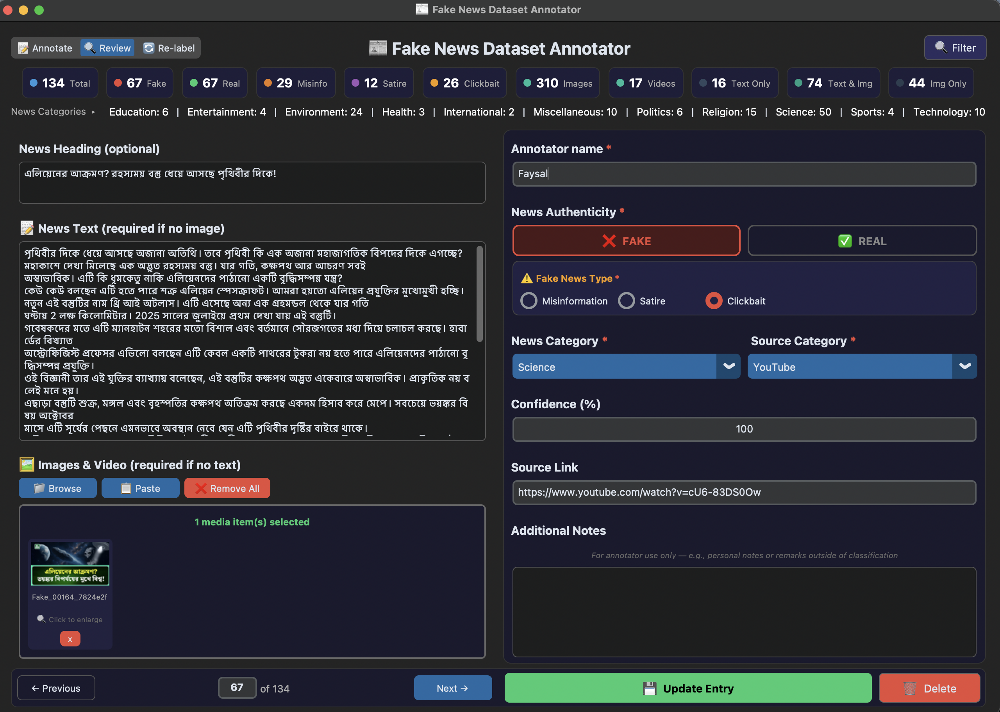

# Fake News Dataset Annotator

A standalone GUI tool for collecting a multimodal fake news detection dataset. Multiple annotators can use this tool to enter news text, attach images and video, classify entries as Fake or Real, and specify the type of fake news. All data is saved in a structured CSV file with images stored locally.

**No coding knowledge required** — download a single file, double-click, and start annotating.

<br>
<p align="center">
  
</p>
<p align="center">
  
  
</p>

---

## Installation

Go to the [**Releases**](../../releases/latest) page and download the file for your operating system:

| File                                       | Platform                     |
| ------------------------------------------ | ---------------------------- |
| `FakeNewsAnnotator-Windows.exe`            | Windows 10/11 (64-bit)       |
| `FakeNewsAnnotator-macOS-AppleSilicon.zip` | macOS (Apple M1/M2/M3/M4/M5) |
| `FakeNewsAnnotator-Linux`                  | Ubuntu / Debian / Fedora     |

### How to run

1. **Download** the file for your OS from the [Releases](../../releases/latest) page
2. **Place it in a folder** (e.g., a new folder on your Desktop)
3. **macOS users (Important)**:
   - Because this app is not signed with a paid Apple Developer account, macOS will quarantine it if downloaded through a web browser, and it will silently fail to open.
   - **Easiest solution (No Quarantine):** Open **Terminal** and paste the exact command for your Mac. This will create a `Fake News Dataset` folder on your Desktop, download the app there, and extract it so you can just double-click to open it:

     _For Mac M1/M2/M3/M4 (Apple Silicon):_

     ```bash
     mkdir -p ~/Desktop/"Fake News Dataset" && cd ~/Desktop/"Fake News Dataset" && curl -L -O https://github.com/Faysal1000/fake-news-annotation-tool/releases/latest/download/FakeNewsAnnotator-macOS-AppleSilicon.zip && unzip -o FakeNewsAnnotator-macOS-AppleSilicon.zip && rm FakeNewsAnnotator-macOS-AppleSilicon.zip
     ```

   - **Alternative manual fix:** If you already downloaded the `.zip` through Safari/Chrome and extracted it, open **Terminal** and type:
     ```bash
     chmod -R +x 
     ```
     _(Make sure to include the space after `+x`)_
   - **Drag and drop** the `FakeNewsAnnotator.app` icon into the Terminal window and press **Enter**. This restores the executable permissions.
   - Next, type this to remove Apple's quarantine lock:
     ```bash
     xattr -cr 
     ```
     _(Make sure to include the space after `-cr`)_
   - **Drag and drop** the app icon into the Terminal again and press **Enter**. You can now double-click the app to open it normally!

4. **Windows users**:
   - You can download it directly from the browser, or open **Command Prompt** (cmd) and paste this to automatically create a `Fake News Dataset` folder on your Desktop and download it there:
     ```cmd
     mkdir "%USERPROFILE%\Desktop\Fake News Dataset" 2>nul & cd "%USERPROFILE%\Desktop\Fake News Dataset" & curl -L -O https://github.com/Faysal1000/fake-news-annotation-tool/releases/latest/download/FakeNewsAnnotator-Windows.exe
     ```
   - Go to the `Fake News Dataset` folder on your Desktop and double-click the `.exe` to launch the tool.

5. **Linux users**:
   - Open your terminal and paste this command to create a `Fake News Dataset` folder on your Desktop, download it there, and make it executable:
     ```bash
     mkdir -p ~/Desktop/"Fake News Dataset" && cd ~/Desktop/"Fake News Dataset" && curl -L -O https://github.com/Faysal1000/fake-news-annotation-tool/releases/latest/download/FakeNewsAnnotator-Linux && chmod +x FakeNewsAnnotator-Linux
     ```
   - Go to the `Fake News Dataset` folder on your Desktop and double-click the file, or run `./FakeNewsAnnotator-Linux` to launch the tool.

The tool will automatically create `dataset.csv`, `images/` and `videos/` folders, and a config file **in the same folder** where the executable is located.

---

## Usage

The application has three modes: **Annotate** (for adding new data), **Review** (for checking and editing existing data), and **Re-label** (for conducting inter-rater reliability tests). You can switch between them using the dropdown switcher at the top left of the screen.

### Annotate Mode

1. **Enter your name** in the "Annotator Name" field (saved automatically for next time)
2. **Select a label**: click either **Fake** or **Real** (required)
3. **If Fake**: select the **Fake News Type** — Misinformation, Satire, or Clickbait (required for Fake entries)
4. **Select News Category** from the dropdown — Politics, Health, Science, etc. (required)
5. **Select Source Category** from the dropdown — News Channel, Facebook, Twitter, etc. (required)
6. **Enter Source Link** — paste the URL where the news was found (optional)
7. **Enter Heading** — the headline or title of the news (optional)
8. **Enter the news text** in the text area (required if no image)
9. **Add media (images/video)** using one of three methods (required if no text):
   - Click **"Browse"** to select image or video files
   - Click **"Paste from Clipboard"** to paste a screenshot
   - Drag and drop images or a video into the drop zone
10. **Add Additional Notes** (optional) — for annotator use only, e.g., personal notes or remarks outside of classification
11. Click **"💾 Save Entry"**
12. A confirmation popup will appear. Fields are cleared for the next entry.

### Review Mode

1. Switch to **Review** mode to browse your saved annotations from `dataset.csv`.
2. Use the **Prev** and **Next** buttons at the bottom to navigate through your records.
3. You can instantly jump to a record by clicking the record number, typing a new number, and pressing Enter.
4. **Edit entries**: Make changes to any field and click **"🔄 Update Entry"**. (If you try to navigate away without saving, the app will warn you!)
5. **Delete entries**: Click the trash can icon at the bottom right to permanently remove an entry.
6. **View Media**: Click on any thumbnail to view the image in full resolution or play the video in your system player.

### Re-label Mode

1. Switch to **Re-label** mode via the top-left dropdown. This mode loads the `relabeling_for_kappa.csv` file for blind secondary rating.
2. Enter your name in the **Annotator Name** field.
3. Browse records in a read-only layout (previous annotations and metadata are hidden to prevent bias).
4. Review the news text, headline, and media previews, choose a rating (**Fake** or **Real**), select the fake news sub-type if Fake, and click **"💾 Save Decision"**.
5. Once saved, a green "ALREADY REVIEWED" badge will appear for the record. The app will automatically advance to the first unrated record for your username.

### Detailed Statistics Dashboard

Click the **"📊 Detailed Stats"** button at the top to open a comprehensive, interactive dashboard:
- **Summary Cards**: View top-level counts and percentages for Real vs. Fake news.
- **Multimodal Grid**: See a breakdown of how your dataset uses different modalities (Text Only, Image Only, Text + Image, etc.) across different classifications.
- **Dual-Mode Interactive Percentages**: The grid calculates percentages dynamically based on what you click!
  - **Click a Column Header**: Shows vertical percentages (e.g., Out of all "Fake" items, what % have "Text Only"?).
  - **Click a Row Header**: Shows horizontal percentages (e.g., Out of all "Text Only" items, what % are "Real" vs "Fake"?). Subclasses like Misinfo calculate relative to the "Fake" total.
- **Dynamic Filters**: Filter the entire dashboard in real-time by selecting a specific **News Category** or a specific **Annotator Name**.
- **Data Export**: Click **"📥 Export to CSV"** and choose to either export the **Current Dashboard** exactly as filtered, or generate a comprehensive report of **All Local Categories** broken down sequentially.

### Team Sync & Global Metrics

You can sync your local metrics to the cloud using a GitHub Gist so your entire team can view each other's progress in real-time inside the **Detailed Statistics Dashboard**.

**1. Setup Cloud Storage (Project Lead)**
- Go to [gist.github.com](https://gist.github.com/)
- Create a secret gist named exactly `metrics.json` and type `{}` in the file body.
- Copy your **Gist ID** from the end of the URL (e.g., `https://gist.github.com/username/GIST_ID`).
- Go to your GitHub **Settings -> Developer Settings -> Personal access tokens (classic)**.
- Generate a new token with **No expiration** and check the **`gist`** scope box. Copy this **Access Token**.

**2. Connect the App (All Annotators)**
- Distribute the **Gist ID** and **Access Token** to your team.
- Open the Annotator App and click **"📊 Detailed Stats"** to open the dashboard.
- Click the **"🌐 Team Sync"** button in the top right.
- Paste the Gist ID and Access Token and click **"Save & Sync"**.

**3. View Global Metrics**
- Once connected, your app will automatically sync your metrics in the background every 5 minutes.
- Inside the Detailed Stats popup, toggle the **"Global Metrics (Team)"** switch to `ON`.
- The dashboard will recalculate to show the **Team Total** and detailed modality metrics (Text Only, Image Only, etc.) broken down by every individual annotator on your team!
- *Note: If two team members use the exact same name on different computers, the app will smartly append a unique ID to their name so you can still track their progress separately.*

### Validation Rules

- **Annotator name** is required
- **Label** (Fake/Real) is required
- **Fake News Type** is required when label is Fake
- **News Category** is required
- **Source Category** is required
- At least **text or image** must be provided
- If text is fewer than 10 words, a warning will appear (you can still save)
- Multiple images can be attached, but only one video per entry.

---

## Output Files

After saving entries, the following files are created **next to the executable**:

```
YourFolder/
├── FakeNewsAnnotator.exe    # The tool (or .app / Linux binary)
├── dataset.csv              # Your annotations (auto-created)
├── relabeling_for_kappa.csv # Balanced inter-rater agreement sample (user-created)
├── .annotator_config.json   # Remembers your name (auto-created)
├── images/                  # Saved images (auto-created)
│   ├── Fake_00001_uuid_YourName.jpg
│   └── ...
└── videos/                  # Saved videos (auto-created)
    ├── Fake_00002_uuid_YourName.mp4
    └── ...
```

### CSV Columns

| Column                  | Description                                                           |
| ----------------------- | --------------------------------------------------------------------- |
| `id`                    | Unique identifier (UUID) — safe for merging across annotators         |
| `heading`               | Optional headline / title of the news item                            |
| `text`                  | News content body                                                     |
| `image_path`            | Relative path(s) to image(s), separated by `;` if multiple            |
| `video_path`            | Relative path to a video file (optional)                              |
| `label`                 | `Fake` or `Real`                                                      |
| `multi_category`        | Fake news sub-type (`Misinformation`, `Satire`, `Clickbait`) or `Real` |
| `source`                | Source link / URL (optional)                                          |
| `source_category`       | Platform where news was found (e.g., `Facebook`, `News Channel`)      |
| `category`              | News topic category (e.g., `Politics`, `Health`)                      |
| `annotator`             | Name of the person who annotated this entry                           |
| `annotation_confidence` | Confidence level of the annotation (0-100, default `100`)             |
| `additional_notes`      | Annotator's internal notes (e.g., personal remarks outside classification)    |
| `timestamp`             | ISO-format datetime when the entry was saved                          |

### Image & Video Naming Convention

Images and videos are saved with this naming pattern:

```
{Label}_{count}_{uuid}_{annotator}.{extension}
```

Example: `Fake_00042_550e8400-e29b-41d4-a716-446655440000_Faysal.jpg`

---

## Submitting Your Data

When you are done annotating, send these to the project lead:

1. Your `dataset.csv` file
2. Your entire `images/` folder
3. Your entire `videos/` folder

Keep the folder structure intact so the media paths in the CSV remain valid.

---

## Aggregating Data from Multiple Annotators

Once multiple annotators have submitted their data, the project lead can easily combine all their work into one master dataset directly within the application.

1. Create a master folder (e.g., `all_annotators_dataset` anywhere on your computer).
2. Place each annotator's entire folder (containing their `dataset.csv`, `images/`, and `videos/` directories) inside this master folder.
   ```text
   all_annotators_dataset/
   ├── Faysal/
   │   ├── dataset.csv
   │   ├── images/
   │   └── videos/
   ├── Alice/
   │   ├── dataset.csv
   │   ├── images/
   │   └── videos/
   └── Bob/
       ├── dataset.csv
       ├── images/
       └── videos/
   ```
3. Open the Annotator Tool.
4. Click the **"Scripts"** button in the top right corner.
5. Under the **"Aggregate Datasets"** column, the tool will prompt you to select the master folder you created in Step 1.
6. It will automatically merge all CSV files into a single `dataset.csv` and safely copy all media into unified `images/` and `videos/` folders.

---

## Inter-Rater Reliability (Kappa Testing)

To calculate agreement statistics (like Cohen's Kappa or Fleiss' Kappa) between multiple annotators, you can run a blind secondary rating workflow using a balanced sample subset directly from the app.

### 1. Generate a Balanced Sample

You can extract a balanced random sample of records from your master `dataset.csv` right from the tool's scripts window.

1. Click the **"Scripts"** button in the top right corner.
2. Under the **"Generate Kappa Sample"** column, select your master `dataset.csv` file when prompted.
3. Choose the number of items to sample (e.g., `500`).
4. **Customize Distribution:** You can adjust the exact percentage of Real vs. Fake records. They will automatically auto-fill to equal 100%.
5. **Customize Fake Sub-categories:** Adjust how the Fake percentage is divided internally (Misinformation, Satire, Clickbait). This uses a cascading auto-fill and must equal 100%.
6. The app will generate a `relabeling_for_kappa.csv` file automatically with your custom distributions.

### 2. Blind Re-labeling

Once `relabeling_for_kappa.csv` is generated:

1. Distribute the `relabeling_for_kappa.csv` file along with the `images/` and `videos/` folders to the annotators.
2. Annotators launch the tool and switch to **🔄 Re-label Mode** via the top-left dropdown switcher.
3. Enter your **Annotator Name** (which must match the name used in your main annotations to correctly track columns).
4. Browse the records (which display the news headline, text, and media in a read-only view). The actual labels previously assigned are hidden.
5. Select a rating (**Fake** or **Real**) and classification type, then click **"💾 Save Decision"**.
6. The tool will automatically save decisions to new dynamic columns in `relabeling_for_kappa.csv` named `{annotator_name}_label` and `{annotator_name}_multi_category`.

### 3. Calculate Kappa Score

Once all annotators have completed their reviews on the same file:

1. Click the **"Scripts"** button in the top right corner.
2. Under the **"Calculate Kappa"** column, select the completed `relabeling_for_kappa.csv` file.
3. The tool will automatically detect how many annotators participated and calculate the Inter-Rater Reliability metrics (Cohen's for 2, Fleiss' for 3+) for both Label and Multi-Category classifications.

---

## For Developers

### Running from source

```bash
# Clone the repository
git clone https://github.com/Faysal1000/fake-news-annotation-tool.git
cd fake-news-annotation-tool/annotator

# Install dependencies
pip install -r requirements.txt

# Run the tool
python annotator_tool.py
```

### Building locally

```bash
pip install pyinstaller
python build.py
```

The executable will be created in the `dist/` folder.

### GitHub Actions CI/CD

The project includes a GitHub Actions workflow (`.github/workflows/build.yml`) that automatically builds executables for all platforms:

- **Automatic**: Push a version tag (e.g., `git tag v1.0.0 && git push --tags`) to trigger a build and create a GitHub Release with all executables
- **Manual**: Go to Actions tab → "Build Annotator Executables" → "Run workflow"

---

## Troubleshooting

| Problem                       | Solution                                                                               |
| ----------------------------- | -------------------------------------------------------------------------------------- |
| macOS blocks the app          | Right-click → "Open" → click "Open" in the dialog                                      |
| macOS app crashes immediately | Download the `.zip` file from Releases and extract it. Do not download the raw binary. |
| Linux: "Permission denied"    | Run `chmod +x FakeNewsAnnotator-Linux` first                                           |
| Windows SmartScreen warning   | Click "More info" → "Run anyway"                                                       |
| Drag and drop not working     | Use the **Browse** or **Paste** buttons instead                                        |
| App window is too small       | Drag the window edges to resize it                                                     |

---

## Categories Reference

### News Categories

Politics, Health, Science, Technology, Sports, Entertainment, Religion, Education, Environment, International, Miscellaneous

### Source Categories

News Channel, Newspaper, Facebook, Twitter, Instagram, Reddit, YouTube, Blog, Website, Miscellaneous

### Fake News Types (Multi-Category)

- **Misinformation** — False information spread without intent to deceive
- **Satire** — Use of humor, irony, or exaggeration to ridicule (often mistaken as real news)
- **Clickbait** — Misleading headlines designed to attract clicks

---

## Bot Server (Telegram Link Routing)

This project includes a built-in Telegram bot (located in the `bot-server/` directory) to easily route news links to assigned annotators. If you find a news article that belongs to another team member's assigned category, you can just text the link to the bot, and it will instantly forward it to them.

### Setup Instructions

1. Create a Telegram bot using BotFather and get your Bot Token.
2. Navigate to the `bot-server/` directory:
   ```bash
   cd bot-server
   ```
3. Rename `.env.example` to `.env` and insert your token:
   ```env
   TELEGRAM_BOT_TOKEN=your_token_here
   ```
4. Have all team members start a conversation with your bot and send the command `/myid` to get their unique Chat IDs.
5. Update the `CHAT_IDS` and `CATEGORIES` dictionaries in `bot-server/telegram_bot.py` with your team's IDs and assigned categories.
6. Run the bot:
   ```bash
   pip install -r requirements.txt
   python telegram_bot.py
   ```

### Usage

Simply send a command followed by the link to the bot:

```
/politics https://news-article-link.com
```

Or use the provided shortcuts (e.g., `/p https://news-article-link.com`). The bot will automatically detect who is in charge of Politics and forward the message to them. Type `/usage` in the bot to see all configured shortcuts.
