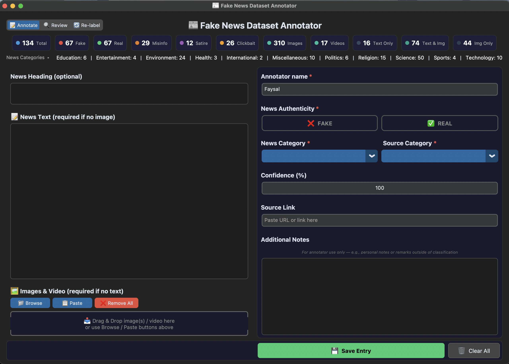
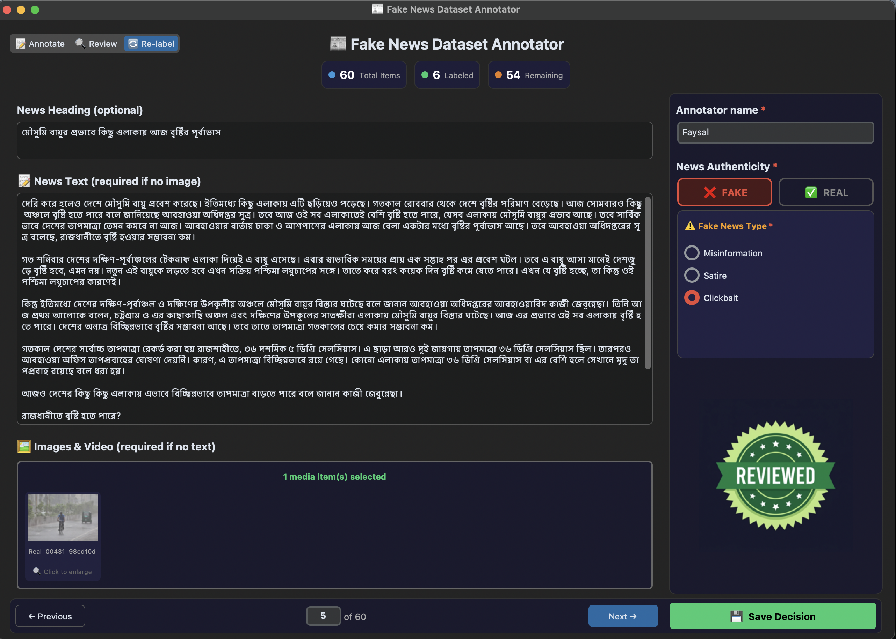

# Fake News Dataset Annotator

A standalone GUI tool for collecting a multimodal fake news detection dataset. Multiple annotators can use this tool to enter news text, attach images and video, classify entries as Fake or Real, and specify the type of fake news. All data is saved in a structured CSV file with images stored locally.

**No coding knowledge required** — download a single file, double-click, and start annotating.

<br>
<p align="center">
  
</p>
<p align="center">
  
  
</p>

---

## Quick Start

Go to the [**Releases**](../../releases/latest) page and download the file for your operating system:

| File                                       | Platform                     |
| ------------------------------------------ | ---------------------------- |
| `FakeNewsAnnotator-Windows.exe`            | Windows 10/11 (64-bit)       |
| `FakeNewsAnnotator-macOS-AppleSilicon.zip` | macOS (Apple M1/M2/M3/M4/M5) |
| `FakeNewsAnnotator-Linux`                  | Ubuntu / Debian / Fedora     |

### Installation Instructions

**1. Windows**: Open Command Prompt (`cmd`) and paste this to automatically create a folder on your Desktop and download it there:
```cmd
mkdir "%USERPROFILE%\Desktop\Fake News Dataset" 2>nul & cd "%USERPROFILE%\Desktop\Fake News Dataset" & curl -L -O https://github.com/Faysal1000/fake-news-annotation-tool/releases/latest/download/FakeNewsAnnotator-Windows.exe
```

**2. macOS (Apple Silicon)**: Open **Terminal** and paste the exact command below. This will download the app, extract it, and automatically bypass Gatekeeper's quarantine warning so you can just double-click to open it:
```bash
mkdir -p ~/Desktop/"Fake News Dataset" && cd ~/Desktop/"Fake News Dataset" && curl -L -O https://github.com/Faysal1000/fake-news-annotation-tool/releases/latest/download/FakeNewsAnnotator-macOS-AppleSilicon.zip && unzip -o FakeNewsAnnotator-macOS-AppleSilicon.zip && rm FakeNewsAnnotator-macOS-AppleSilicon.zip
```
*(If you download the .zip manually, put the extracted `FakeNewsAnnotator.app` into a folder on your Desktop named `Fake News Dataset`, open Terminal and run `chmod -R +x ~/Desktop/"Fake News Dataset"/FakeNewsAnnotator.app && xattr -cr ~/Desktop/"Fake News Dataset"/FakeNewsAnnotator.app`)*

**3. Linux**: Open your terminal and paste this command to download it and make it executable:
```bash
mkdir -p ~/Desktop/"Fake News Dataset" && cd ~/Desktop/"Fake News Dataset" && curl -L -O https://github.com/Faysal1000/fake-news-annotation-tool/releases/latest/download/FakeNewsAnnotator-Linux && chmod +x FakeNewsAnnotator-Linux
```

---

## Core Features

You can switch between the app's three primary modes using the dropdown switcher at the top left of the screen:

- **Annotate Mode**: Add new entries to the dataset. Select labels, add text, drag-and-drop media, and save.
- **Review Mode**: Browse through your saved annotations. You can edit mistakes, delete entries, and view attached media in full resolution.
- **Re-label Mode**: Conduct inter-rater reliability tests. Browse a pre-generated sample of records with the previous labels hidden to prevent bias.
- **📊 Detailed Stats**: Click the button at the top to open a comprehensive, interactive dashboard. Click row/column headers to dynamically calculate multi-modal distribution percentages.

---

## Data Management

All data is generated locally. The tool will automatically create `dataset.csv`, `images/` and `videos/` folders, and a config file **in the same folder** where the executable is located.

### Dataset Output Format
The `dataset.csv` file automatically records:
- A unique `id` and `timestamp` for safe merging.
- Your `annotator` name and `annotation_confidence`.
- The `label` (Fake/Real) and `multi_category` (Misinformation/Satire/Clickbait).
- The `heading`, body `text`, and the platform `source_category`.
- The exact relative paths to any saved media (`image_path`, `video_path`).

The tool also maintains a `non_duplicates.json` file which safely stores any pairs of news articles you manually marked as "Non Duplicate" during the multi-core accelerated duplicate auditing so they don't get flagged again. You can adjust the exact matching threshold or enable all CPU cores to audit 10K+ datasets in seconds directly from the duplicates popup.

- **Submitting Data**: When you are done annotating, send your `dataset.csv`, `non_duplicates.json`, and your `images/` and `videos/` folders to your project lead.
- **Aggregating Data**: Project leads can combine work from multiple annotators. Put everyone's folders into one master folder, open the Annotator Tool, click **"Scripts"** (top right), and select **"Aggregate Datasets"**. The script will automatically merge both the dataset records and the marked non-duplicates list seamlessly.

---

## Advanced Features

- **Team Sync**: You can sync your local metrics to the cloud using a GitHub Gist so your entire team can view each other's progress in real-time. Setup instructions are inside the app's "Detailed Stats -> Team Sync" menu.
- **Inter-Rater Reliability (Kappa Testing)**: You can extract a balanced random sample of records from your master `dataset.csv` right from the tool's **Scripts** menu. Distribute this sample to your team for blind re-labeling, and calculate the Kappa score automatically.
- **Telegram Bot Integration**: This project includes a built-in Telegram bot (located in the `bot-server/` directory) to easily route news links to assigned annotators. See the bot directory for setup details. 

---

## For Developers

```bash
# Clone the repository
git clone https://github.com/Faysal1000/fake-news-annotation-tool.git
cd fake-news-annotation-tool

# Enable local Git hooks (prevents pushing mismatched version tags)
git config core.hooksPath .githooks

cd annotator

# Install dependencies
pip install -r requirements.txt

# Run the tool
python main.py
```

### Repository Structure

```
Fake News Dataset Annotator/
├── .github/
│   └── workflows/
│       └── build.yml               # GitHub Actions CI/CD automated release builder
├── annotator/                      # Main desktop annotation application
│   ├── main.py                     # Entry point (adds src/ to path, launches application)
│   ├── build.py                    # PyInstaller standalone compiler script
│   ├── requirements.txt            # Desktop application package requirements
│   └── src/                        # Desktop application source directory
│       ├── bootstrap.py            # Verifies dependencies and tkinterdnd2 dynamically
│       ├── app_paths.py            # Static directory and file location resolvers
│       ├── constants.py            # Application options, categories, and labels config
│       ├── version.json            # Version tracker file (v12.0.0)
│       ├── assets/                 # App icon files (.icns/.ico/.svg/.png) & media badges
│       ├── data/                   # Dataset CSV I/O, config files, and statistics engines
│       │   ├── csv_manager.py      # Handles CSV database schemas & file migrations
│       │   ├── config_manager.py   # Reads/writes annotator local config file
│       │   └── stats_engine.py     # Calculates dataset counts (items, images, videos)
│       ├── analysis/               # Analytical agreement and data aggregation utilities
│       │   ├── text_similarity.py  # Text cleaning & Jaccard/containment checks
│       │   ├── kappa.py            # Pairwise Cohen & Fleiss Kappa calculators
│       │   └── aggregator.py       # Combines multiple annotators' datasets and generates samples
│       ├── ui/                     # Interface builders, dialogs, panels, and custom widgets
│       │   ├── main_window.py      # App orchestrator class and mixins multiple inheritance
│       │   ├── build_ui.py         # Constructs and positions CTk layout frames/grids
│       │   ├── stats_popup.py      # Full detailed stats interactive popup window
│       │   ├── duplicate_popup.py  # Interactive side-by-side duplicate comparison modal
│       │   ├── filter_panel.py     # Advanced search filter query criteria dialog
│       │   ├── scripts_popup.py    # Merging datasets & generating agreement samples launcher
│       │   ├── dialogs.py          # Custom CTk confirmation yes/no/cancel modals
│       │   └── widgets.py          # FlowFrame wrapping container class
│       ├── modes/                  # Screen views layout managers
│       │   ├── mode_controller.py  # Manages toggle transitions between modes
│       │   ├── annotate_mode.py    # Save & validate entry view
│       │   ├── review_mode.py      # Pagination, updates, and deletion review view
│       │   └── relabel_mode.py     # blind inter-annotator Kappa ratings view
│       ├── duplicates/             # Inline & global audits
│       │   └── duplicate_engine.py # Background duplicate auditing thread & inline counts badge
│       ├── media/                  # Video & Audio playback
│       │   └── media_manager.py    # Previews, saves, and scales attached graphics & clips
│       ├── shortcuts/              # Hotkeys
│       │   └── keyboard.py         # Binds hotkey triggers (Ctrl+S, Ctrl+Arrows, etc.)
│       ├── updater/                # Auto-updates
│       │   └── update_manager.py   # Asynchronously checks release updates and runs installers
│       └── sync/                   # Metrics sync
│           └── global_sync.py      # Asynchronous team progress metrics Gist upload loop
└── bot-server/                     # Telegram distribution bot server
    ├── telegram_bot.py             # Main bot execution logic (polling mode)
    ├── setup_webhook.py            # Webhook registration script
    ├── vercel.json                 # Vercel deployment configuration
    ├── requirements.txt            # Telegram bot server requirements
    └── api/
        └── index.py                # Serverless webhook entry point for Vercel
```

### GitHub Actions CI/CD
The project includes a GitHub Actions workflow (`.github/workflows/build.yml`) that automatically builds executables for all platforms. Push a version tag (e.g., `git tag v12.0.0 && git push --tags`) to trigger a build and create a GitHub Release.

---

## Troubleshooting

| Problem                       | Solution                                                                               |
| ----------------------------- | -------------------------------------------------------------------------------------- |
| macOS blocks the app          | Right-click → "Open" → click "Open" in the dialog                                      |
| macOS app crashes immediately | Download the `.zip` file from Releases and extract it. Do not download the raw binary. |
| Linux: "Permission denied"    | Run `chmod +x FakeNewsAnnotator-Linux` first                                           |
| Windows SmartScreen warning   | Click "More info" → "Run anyway"                                                       |
| Drag and drop not working     | Use the **Browse** or **Paste** buttons instead                                        |
| App window is too small       | Drag the window edges to resize it                                                     |
